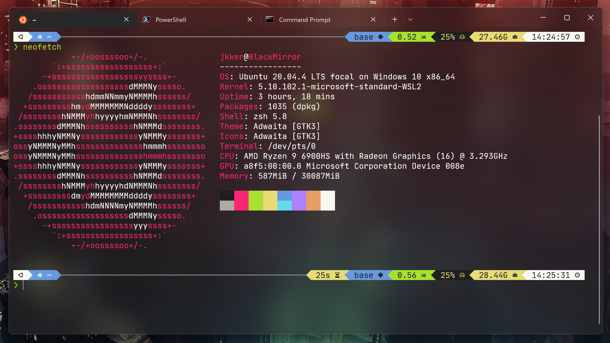

# CLI & Git Workshop

> If you follow through this workshop, you will receive a unique animal avatar 🐱 generated from your user name.
> Trust me, it’s kinda NFT; it's just not on a block chain.

⌛ **Estimated Length**: 25 minutes

👤 **Author**: Jerry Jia

## Outline

- [Using CLI](#using-cli)
  - [CLI? Shell? Terminal?](#cli-shell-terminal)
  - [Getting Started](#getting-started)
  - [Commands](#commands)
  - [CLI Recap](#cli-recap)
  - [Useful CLI Resources](#cli-resources)
- [Git It Done](#git-it-done)
  - [What does Git do?](#what-does-git-do)
  - [What is GitHub?](#what-is-github)
  - [Getting Started](#getting-started-1)
  - [Working with Local Repository](#working-with-local-repository)
  - [Creating Repository on GitHub](#creating-repository-on-github)
  - [Using Git for Collaboration](#using-git-for-collaboration)
  - [Useful Git Resources](#git-resources)


# Using CLI

## CLI? Shell? Terminal?



We mostly use mouse, trackpad, and graphical user interfaces (GUI) in nowadays. In fact, there’s another way you can do things on a computer that makes you look like a pro: CLI.

CLI stands for **Command Line Interface.** It’s a quick and powerful interface for developers to communicate with computers to accomplish a wider set of tasks.

To begin, you need to open your **shell** in a **terminal**. A shell program wraps around the operating system to expose a human-friendly command line interface. And the **terminal** displays a graphical interface for users to interact with shells.

Here’s a quick recap:

- **Command Line Interface (CLI)**: receives text commands from a user to communicate with a computer; alternative to graphical user interface (GUI)
- **Shell**: a program that exposes an operating system's services to a human user or other programs
- **Terminal/Console**: a program that displays a GUI for users to interact with the CLI

## Getting Started

Each operating system ships with different shells and terminals. Some are easier to work with while some are not.

Please [**install VSCode**](https://code.visualstudio.com/download) as well.

### Mac

press  `command` + `space` to launch Spotlight Search, type `terminal.app` and hit `return`.

- The default shell on MacOS is called `zsh`

### Windows

**Option 1: WSL (Recommended) - Follow this [installation guide](https://docs.microsoft.com/en-us/windows/wsl/install)**

Windows Subsystem for Linux (WSL) allows users to install a Linux distribution (e.g. Ubuntu) on a Windows machine. It provides the best overall developer experience with a native Linux environment. Also, Most servers run Linux as well, so it’s good to familiarize yourself with it.

**Option 2: Git Bash**

Git Bash bundles many UNIX tools with the most commonly used **`bash`** shell. It provides the nearest experience to Linux on Windows and was the go-to option before WSL was introduced.

1. [Download `git`](https://git-scm.com/download/win)
2. Follow [these instructions](https://www.stanleyulili.com/git/how-to-install-git-bash-on-windows/) to make sure that `git bash` is installed during the process
3. Press `windows`,type `git bash` and press `enter`

**Option 3: PowerShell**

Powershell is the most commonly used shell program on Windows, but many of its syntax is different with Linux’s. So, some of the commands we will use in the following steps won’t work.

- Press `windows`, type `powershell` and press `enter`

### Linux

You probably know these stuff already. Kudos to you.

## Commands

### Print String `echo`

```bash
echo "hello world"
```

You probably know what this means. `echo` just prints the string that follows it.

### Change Directory `cd`

```bash
cd ~
```

`cd` = change directory. This is the command that you will use very often for navigation.

- `~` here stands for your home directory. Every user in the system has access to own home directory but usually not others’.
- You can open the current directory in the GUI
    - Windows: `explorer.exe .`
    - Mac: `open .`

    `.` here stands for the current directory


### Know Where You Are `pwd`

```bash
pwd
```

This prints your current path. It should be something like `/home/<your-username>`

You can use `whoami` to get your user name as well.

### List Directory Content `ls`

```bash
ls
```

Now you will see what’s in your home directory

- For more verbose output, use `ls -la`
    - `-l` use a long listing format that includes file permissions, owner, date, etc.
    - `-a` includes hidden files (e.g. file names that start with a dot `.`)

### Create Folder `mkdir`

```bash
mkdir workshop
```

This creates a folder (directory) in the current location. Now, if you `ls` again, you should see the `workshop` folder in the output.

### Change Directory `cd path`

```bash
cd workshop
```

Now, you are in the workshop folder.

### Create File `touch`

```bash
touch hello
```

This creates an empty file called `hello`.

### Redirect Output `>`

```bash
echo "hello world" > hello
```

`>` redirects the output from `echo` to the file `hello`.

### View File Content `cat`

```bash
cat hello
```

You can use `head` or `tail` to view only a portion of the file.

- Add `-n NUMBER` to view a certain number of lines only. For example, `tail -n 10 server.log`  only prints the last 10 lines of `server.log`.

### Copy File `cp`

```bash
cp hello world
```

`cp` = copy. Now with `ls`, you should see two files in the current directory.

### Rename & Move File `mv`

```bash
mv world universe
```

`mv` actually means move. Moving the `world` file to `universe` is renaming it.

You can use this command to move files, too (surprise, surprise)

```bash
mkdir metaverse
mv universe metaverse
cd metaverse
ls
```

We’ve just moved `universe` into `metaverse` and entered `metaverse` to verify it.

### Remove File `rm`

```bash
rm universe
```

Now use `ls` to verify that it’s removed.

### Leave a Folder `cd ..`

```bash
cd ..
```

`..` = parent directory. Now we’re back in the `workshop` directory.

### Remove Directory `rmdir`

```bash
rmdir metaverse
```

However, if this folder is not empty, you will need to use `rm -r`

- `-r` stands for **recursive**.
- Add `-f` to **force remove** all files without needing to confirm each action.

> PRO TIP: be cautious with `rm -rf`. Something like `rm -rf /` could break your system.
>

### Check the Manual `man`

```bash
man curl
```

This opens the manual for `curl`. You can use your arrow key to scroll up and down or type `q` to quit. This is an alternative to Googling this command.

### Download File `curl`

```bash
curl http://example.com --output e.html
```

This downloads the content of this website to a file. You can use `ls` and `cat`/`head`/`tail` to see what you have just downloaded.

### Search Text `grep`

```bash
cat e.html | grep h1
```

- `|` pipes the output of the previous command to the next.
- `grep` here searches for a line that contains `h1` in its input.

You should see `<h1>Example Domain</h1>` in the output.

### Clear the Terminal `clear`

```bash
clear
```

Now everything should be gone!

### View History `history` / ⬆️ / ⬇️

You can use your up & down arrow keys to find the previous commands you typed.

`history` will print all your history commands.

With what we’ve just learned, you can use `grep` to search for a command you typed history.

```bash
history | grep "curl"
```

## CLI Recap

| Command     | Description                                        | Example                    |
| ----------- | -------------------------------------------------- | -------------------------- |
| echo        | Print string                                       | echo “hello world”         |
| ls          | List the directory (folder) system.                | ls -la                     |
| cd pathname | Change directory (folder) in the file system.      | cd ~                       |
| cd ..       | Move one level up (one folder) in the file system. | cd ..                      |
| touch       | Create an empty file                               | touch hello                |
| cp          | Copy a file.                                       | cp hello world             |
| mv          | Move (rename) a file.                              | mv world universe          |
| mkdir       | Creates a new directory (folder).                  | mkdir metaverse            |
| rmdir       | Remove a directory (folder).                       | rmdir metaverse            |
| clear       | Clears the CLI window.                             | clear                      |
| man command | Shows the manual for a given command.              | man curl                   |
| curl        | Transfer data to/from a URL                        | curl https://ipapi.co/json |
| history     | View shell command history                         | history                    |
| grep        | Search for lines that contains certain text        | history \| grep curl       |

## CLI Resources

If you are ever confused about what a command does, [explainshell.com](http://explainshell.com) can help you figure it out.


### Cheat Sheets

[sudheerj/Linux-cheat-sheet: List of Linux commands (github.com)](https://github.com/sudheerj/Linux-cheat-sheet)

[chubin/cheat.sh: the only cheat sheet you need (github.com)](https://github.com/chubin/cheat.sh)

[Linux Command Cheat Sheet (guru99.com)](https://www.guru99.com/linux-commands-cheat-sheet.html)

# Git It Done

Git is free and open source software for distributed **version control**.

Imagine writing a final paper with 3 classmates. Each of you writes a part of it and send multiple copies at different times to different people for edits. You will need to merge all the paragraphs and edits, likely conflicting, into one final draft - if that sounds chaotic already, Git is to your rescue.

## What does Git do?

- Track **changes**
- Document changes with **commits**
- **Branch** from a commit for changes that won’t affect others
- **Merge** different branches onto each other
- Manage projects with **repositories** on a remote
- **Clone** a project to work on a local copy
- **Pull** the latest version of the project to a local copy
- **Push** local updates to the main project

## What is GitHub?

GitHub is a private company owned by Microsoft. It is currently hosts the most number of git repositories and provides the best overall user experience for free. Alternatives include GitLab, Bitbucket, etc.

## Getting Started

Set your git user name and email consistent to your GitHub account.

```bash
git config --global user.name "YOUR USERNAME"
git config --global user.email "YOUR EMAIL"
```

### SSH (Recommended)

SSH is the most secure and convenient way to connect your local machine to GitHub.

Checkout this [GitHub Docs](https://docs.github.com/en/authentication/connecting-to-github-with-ssh/about-ssh) for using it.

## Working with Local Repository

In the `workshop` folder, run

```bash
git init
```

This initializes the current directory as a Git repository. A hidden `.git` folder is created to store the information. To delete the repository, remove the `.git` folder with `rm -rf .git`.

### Check Status

```bash
git status
```

This tells you what’s going on in this repository. Now, the `hello` file should appear as **untracked**.

### Track File

```bash
git add hello
```

This allows git to start tracking this file. Now, type `git status` again to confirm this.

You can use `git add *` to add all files or `git add .` to include folders as well.

### View Change

```bash
git diff --cached
```

You can see what changes you have made to the files being tracked by git.

### Commit Change

```bash
git commit -m "added hello"
```

This creates a commit of your changes with a message. Commits can be thought of as snapshots or milestones along the timeline of a Git project.

](images/Untitled%202.png)

Source: [Git Commit | Atlassian Git Tutorial](https://www.atlassian.com/git/tutorials/saving-changes/git-commit)

It’s a good practice to write a descriptive message with each commit to tell others and remind yourself about what changes are made.

### View Logs

```bash
git log
```

You can now see that your commit is recorded in the logs. Press `q` to exit.

### Rename Branch

```bash
git branch -M main
```

This renames the current branch to main. Some legacy Git clients uses `master` as the name for the default branch, which is deprecated due to political correctness.

### Create Branch

You can branch off from any commit (snapshot) in Git to make changes that won’t affect others. This creates a tree-like structure shown in the diagram below:

](images/Untitled%203.png)

Source: [Git Branch | Atlassian Git Tutorial](https://www.atlassian.com/git/tutorials/using-branches)

The default branch is called master or main. It represents the base of a repository or intuitively, root of the tree.

```bash
git checkout -b test
```

- `checkout` switches to a different branch and carries all previous commits with it.
- `-b` creates new a branch if none exists yet from the default.

Our new branch should have the previous commit. You can use `git log` to verify this.

### View Branch

```bash
git branch
```

You’ll get a list of all existing branches. Press `q` to exit.

To continue, make some changes to `hello` or create a new file and commit the changes to the `test` branch.

### Switch Branch

```bash
git switch main
```

Switches back to the default branch **without** carrying the commits.

### Merge Branch

```bash
git merge test
```

Your new commit on the test branch now merges back to the main/master branch! If the changes don’t conflict, you’re done. If there are conflicts, `git diff` can display them. Once you’ve edited the files to resolve the conflicts, add them and create a new commit.

### Delete Branch

```bash
git branch -D test
```

Given that the merge is successful, we can now safely delete the test branch.

## Creating Repository on GitHub

Go to [Create a New Repository (github.com)](https://github.com/new).

After you successfully created a repo, GitHub tells you how you can push an existing repository.

### Add Remote

```bash
git remote add origin https://github.com/<USERNAME>/<REPO_NAME>.git
```

`remote` simply means a place that hosts your repository. Here we create a `remote` called `origin` and sets its url to what GitHub provides you.

### Push Changes

```bash
git push -u origin main
```

Now, commits and branches in your local repository are pushed to GitHub. You can open the URL to see your code there.

## Using Git for Collaboration

You will learn how to work with a public GitHub repository and receive an animal avatar at the end!

### Workflow

To propose changes to someone else's project, we follow these steps:

1. Fork the repository
2. Make the fix
3. Submit a pull request to the project owner

### Fork Repository

A fork is a copy of a repository. Forking a repository allows you to freely experiment with changes without affecting the original project.

1. Open [Jkker/git-animal](https://github.com/Jkker/git-animal)
2. Give a star for karma (jk)
3. Click fork

    


### Clone Repository

You should now have a copy of this repo in your own account. Copy the URL and clone it locally with this command

```bash
git clone https://github.com/<YOUR_USERNAME>/git-animal

cd git-animal
```

### Make Changes

Try to do these steps on your own what what we’ve just learned. However, if you run into any problem, feel free to peak at the commands below.

1. Create a new branch that has the same name as your GitHub account' user name
2. Create a new file with your user name
3. Add some content
4. Add the file
5. Commit the changes
6. Push the changes

```bash
git checkout -b <BRANCH_NAME>
echo "hello world" > FILE_NAME.txt
git add .
git commit -m "created FILE_NAME.txt"
git push -u origin <BRANCH_NAME>
```

### Create Pull Request

Your changes should now be in your GitHub fork already. For the original repository to accept those changes, you need to submit a `pull request`. It means that you are requesting the original repository to pull the changes from your repository.

1. Open your repository in the browser
2. Go to the ***Pull Request*** tab and click ***New pull request***

    

3. Verify that **base repository** on the left should be the **original** repository; **head repository** on the right should be **your fork**.

    

4. Write a meaningful title & create the pull request!

Now check out the comment section to receive your animal avatar 🐱.

## Git Resources

[Git Cheat Sheet By GitHub](https://education.github.com/git-cheat-sheet-education.pdf)

[Dangit, Git!?!](https://dangitgit.com/): Git is hard: messing up is easy, and figuring out how to fix your mistakes is impossible. This project comes to your rescue if you run into problems with Git.


### VSCode Plugins Recommended

[GitLens - Git supercharged - Visual Studio Marketplace](https://marketplace.visualstudio.com/items?itemName=eamodio.gitlens)

[gitignore - Visual Studio Marketplace](https://marketplace.visualstudio.com/items?itemName=codezombiech.gitignore)

# References

[Git - gittutorial Documentation](https://git-scm.com/docs/gittutorial)

[Git It? How to use Git and Github](https://youtu.be/HkdAHXoRtos)

[What is Command Line Interface (CLI)? | w3schools](https://www.w3schools.com/whatis/whatis_cli.asp)

[roma-lukashik/animal-avatar-generator](https://github.com/roma-lukashik/animal-avatar-generator)
